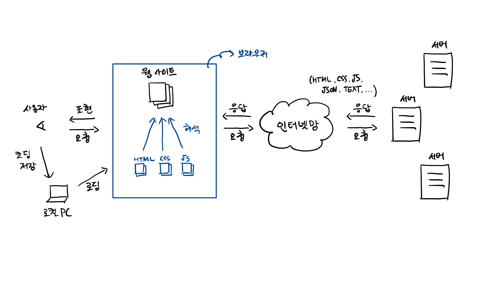

# HTML 개요

[HTML(Hyper Text Markup Language)](https://en.wikipedia.org/wiki/HTML)은 웹 페이지 문서를 표현하기 위한 마크업 언어입니다. 과거에는 정보 전달 기능이 주요 목적이었으며 말 그대로 구조적인 문서를 표현하기 위해 개발되었지만, 웹의 비약적인 발전으로 인해 사용자들이 폭발적으로 늘어 현재는 대부분의 웹 페이지를 구성하는 대중적인 언어가 되었습니다.

현대의 웹 페이지는 HTML만으로 구성되어 있지는 않습니다. 크게 두 가지를 추가해야 하는데, [CSS(Cascading Style Sheet)](https://en.wikipedia.org/wiki/CSS)와 [Javascript](https://en.wikipedia.org/wiki/JavaScript)입니다. 이들 각각이 웹 페이지에서 하는 역할을 보면 아래와 같습니다.

- **HTML**: 정보 전달
- **CSS**: 디자인 표현
- **Javascript**: 상호 작용

이 세 가지는 현재 웹 페이지를 구성하는 기본 요소로 여겨지며, 웹 페이지를 직접 작성하는 개발자가 아니더라도 기본적인 상식으로 알고 있으면 많은 도움이 될 수 있습니다.

## 웹 페이지가 우리 눈으로 보이기까지

HTML을 살펴보기 전에 HTML의 개념을 좀 더 이해하기 위해 웹 페이지가 우리에게 전달되는 과정을 생각해봅시다. 과정은 크게 아래와 같이 나눌 수 있습니다.

1. 문서 작성 = 정적 파일 (HTML, CSS, Javascript)
2. 문서 저장 = 로컬 PC, 서버
3. 문서 검색 = 문서 위치 입력
4. 문서 표현 = 브라우저



여기서 주목해야할 것은 문서 표현 단계입니다. 문서 표현 단계에서 브라우저는 최종적으로 전달된 정적 파일(HTML, CSS, Javascript)을 **해석**하여 시각적으로 그려주는 역할을 합니다. 이 때 문제가 발생하는데, 작성된 정적 파일은 동일한데 브라우저 별로 해석하는 방식과 성능이 다르기 때문에 사용자가 어떤 브라우저를 통해 웹 페이지를 보는지가 웹 개발자에게는 중요한 문제가 됐습니다.

이는 브라우저의 시장 점유율에 따라 웹 기술이 영향을 받는 결과를 초래하게 되었고, 한 때 웹 개발자들을 괴롭히는 이슈였습니다. 하지만 이는 웹 표준화 및 다양한 해결 방법을 통해 대부분 해소되었고, 결과적으로 현재 시점으로 전 세계에서 가장 많이 사용되는 브라우저인 [크롬 브라우저](https://en.wikipedia.org/wiki/Google_Chrome)를 기준점으로 생각하면 됩니다.

## 요소 (Elements)

[요소(Elements)](https://en.wikipedia.org/wiki/HTML_element)는 HTML 문서를 구성하는 기본 단위입니다. 다른 용어로 태그(Tag)라고 불리기도 합니다. 여는 기호(<)와 닫는 기호(>)로 표현되며, 아래와 같은 태그들이 존재합니다. ([w3schools.com](https://www.w3schools.com/tags/) 참고)

```
<!-->, <!DOCTYPE>, <a>, <abbr>, <acronym>, <address>, <applet>, <area>, <article>, <aside>, <audio>, <b>, <base>, <basefont>, <bdi>, <bdo>, <big>, <blockquote>, <body>, <br>, <button>, <canvas>, <caption>, <center>, <cite>, <code>, <col>, <colgroup>, <data>, <datalist>, <dd>, <del>, <details>, <dfn>, <dialog>, <dir>, <div>, <dl>, <dt>, <em>, <embed>, <fieldset>, <figcaption>, <figure>, <font>, <footer>, <form>, <frame>, <frameset>, <h1>, <h2>, <h3>, <h4>, <h5>, <h6>, <head>, <header>, <hr>, <html>, <i>, <iframe>, , <input>, <ins>, <kbd>, <label>, <legend>, <li>, <link>, <main>, <map>, <mark>, <meta>, <meter>, <nav>, <noframes>, <noscript>, <object>, <ol>, <optgroup>, <option>, <output>, <p>, <param>, <picture>, <pre>, <progress>, <q>, <rp>, <rt>, <ruby>, <s>, <samp>, <script>, <section>, <select>, <small>, <source>, <span>, <strike>, <strong>, <style>, <sub>, <summary>, <sup>, <svg>, <table>, <tbody>, <td>, <template>, <textarea>, <tfoot>, <th>, <thead>, <time>, <title>, <tr>, <track>, <tt>, <u>, <ul>, <var>, <video>, <wbr>
```

## HTML 기본 구조

HTML 문서의 기본 구조는 아래와 같습니다. 크게 보면 `head` 부분과 `body` 부분으로 나뉘며 이를 `html`로 감싸는 형태입니다.

```html
<!DOCTYPE html>
<html>
    <head>
        <title>사이트 제목</title>
    </head>
    <body>
        사이트 내용
    </body>
</html>
```

### HTML 작성해보기

아래 HTML 코드를 통해 직접 웹 페이지를 확인해봅시다. 웹 페이지 확인은 아래와 같은 방법으로 가능합니다.

- 파일 저장해서 크롬 브라우저로 확인하기
- [https://jsfiddle.net/](https://jsfiddle.net/) 에서 코드 실행하기

```html
<!DOCTYPE html>
<html>
<head>
    <title>HTML 요소를 사용해봅시다.</title>
</head>
<body>
    <!-- div는 division의 약자로, 구획을 나누기위한 용도로 사용됩니다. -->
    <div>

        <!-- h1 ~ h6는 heading의 약자로, 제목을 표현할 때 쓰는 태그입니다. -->
        <h1>안녕하세요? 1번 제목입니다.</h1>
        <h2>안녕하세요? 2번 제목입니다.</h2>
        <h3>안녕하세요? 3번 제목입니다.</h3>

        <h4>청춘예찬</h4>

        <!-- p는 paragraph의 약자로, 단락을 표현하는 태그입니다. -->
        <p style="width: 30%">
            청춘! 이는 듣기만 하여도 가슴이 설레는 말이다. 청춘! 너의 두 손을 가슴에 대고, 물방아 같은 심장의 고동을 들어 보라. 청춘의 피는 끓는다. 끓는 피에 뛰노는 심장은 거선(巨船)의 기관(汽罐)같이 힘있다. 이것이다. 인류의 역사를 꾸며 내려온 동력은 바로 이것이다. 이성(理性)은 투명하되 얼음과 같으며, 지혜는 날카로우나 갑 속에 든 칼이다. 청춘의 끓는 피가 아니더면, 인간이 얼마나 쓸쓸하랴? 얼음에 싸인 만물(萬物)은 죽음이 있을 뿐이다.
        </p>

        <p style="width: 30%">
            그들에게 생명을 불어넣는 것은 따뜻한 봄바람이다. 풀밭에 속잎 나고, 가지에 싹이 트고, 꽃 피고 새 우는 봄날의 천지는 얼마나 기쁘며, 얼마나 아름다우냐? 이것을 얼음 속에서 불러내는 것이 따뜻한 봄바람이다. 인생에 따뜻한 봄바람을 불어 보내는 것은 청춘의 끓는 피다. 청춘의 피가 뜨거운지라, 인간의 동산에는 사랑의 풀이 돋고, 이상(理想)의 꽃이 피고, 희망(希望)의 놀고 뜨고, 열락(悅樂)의 새가 운다.
        </p>

        <!-- a는 anchor의 약자로, 웹 사이트 간 이동을 위한 링크를 줄 때 사용됩니다. -->
        <a href="https://naver.com" target="blank">네이버 열기</a>

        <!-- br은 break의 약자로, 줄바꿈할 때 사용됩니다. -->
        <br><br>

        <!-- button은 클릭했을 때 지정된 동작을 수행할 수 있도록 도와주는 태그입니다. -->
        <button onclick="alert('버튼을 눌렀습니다.')">버튼</button>

        <br><br>

        <!-- form은 데이터를 특정 양식에 맞춰 서버에 전송하기 위한 태그입니다. form 내부에 input 필드를 통해 다양한 입력값을 받을 수 있습니다. -->
        <form action="">
            <label for="checkbox-example">체크박스:</label>
            <input type="checkbox" name="checkbox-example" id="checkbox-example">
            <label for="date">날짜:</label>
            <input type="date" name="date" id="date">
            <label for="email">이메일:</label>
            <input type="email" name="email" id="email">
            <input type="submit" value="제출하기">
        </form>

        <br>

        <!-- select는 다수의 선택 항목을 드랍다운 형식으로 표현하기 위한 태그입니다. option 태그와 함께 사용됩니다. -->
        <select onchange="document.getElementById('city-number').innerText = this.value">
            <option value="02">서울</option>
            <option value="031">경기도</option>
            <option value="032">인천광역시</option>
            <option value="033">강원도</option>
        </select>

        <!-- span은 div와 비슷하지만, inline 요소를 하나로 묶을 때 사용됩니다. 주로 특정 글자에 스타일을 주고싶을 때 사용됩니다. -->
        <span id="city-number"></span>

        <br><br>

        순서 없는 목록:

        <!-- ul은 unordered list의 약자로, 순서 없는 목록을 표현하는 태그입니다. -->
        <ul>
            <!-- li는 list item의 약자로, 목록 내의 각 요소를 표현하는 태그입니다. -->
            <li>목록 첫 번째</li>
            <li>목록 두 번째</li>
            <li>목록 세 번째</li>
        </ul>

        순서 있는 목록:

        <!-- ol은 ordered list의 약자로, 순서 있는 목록을 표현하는 태그입니다. -->
        <ol>
            <li>목록 첫 번째</li>
            <li>목록 두 번째</li>
            <li>목록 세 번째</li>
        </ol>

        <br><br>

        <!-- table은 말 그대로 테이블을 표현하기 위한 태그입니다. table 내부에 thead, tbody, th, tr, td 태그를 사용합니다. -->
        <table>
            <thead>
                <th></th>
                <th>이름</th>
                <th>성별</th>
                <th>기혼유무</th>
            </thead>
            <tbody>
                <tr>
                    <td>
                        
                    </td>
                    <th>김범수</th>
                    <td>남</td>
                    <td>N</td>
                </tr>
                <tr>
                    <td>
                        
                    </td>
                    <th>나얼</th>
                    <td>남</td>
                    <td>N</td>
                </tr>
                <tr>
                    <td>
                        
                    </td>
                    <th>박효신</th>
                    <td>남</td>
                    <td>N</td>
                </tr>
                <tr>
                    <td>
                        
                    </td>
                    <th>이수</th>
                    <td>남</td>
                    <td>Y</td>
                </tr>
            </tbody>
        </table>
    </div>
</body>
</html>
```

## 속성 (Attributes)

[속성(attributes)](https://en.wikipedia.org/wiki/HTML_attribute)은 HTML 요소를 제어하기 위해 태그 안에 추가적으로 제공되는 정보입니다. 이름-값 형태로 정의되며 아래와 같은 요소들이 정의됩니다.

```
accept, accept-charset, accesskey, action, align, alt, async, autocomplete, autofocus, autoplay, bgcolor, border, charset, checked, cite, class, color, cols, colspan, content, contenteditable, controls, coords, data, data-*, datetime, default, defer, dir, dirname, disabled, download, draggable, enctype, for, form, formaction, headers, height, hidden, high, href, hreflang, http-equiv, id, ismap, kind, label, lang, list, loop, low, max, maxlength, media, method, min, multiple, muted, name, novalidate, onabort, onafterprint, onbeforeprint, onbeforeunload, onblur, oncanplay, oncanplaythrough, onchange, onclick, oncontextmenu, oncopy, oncuechange, oncut, ondblclick, ondrag, ondragend, ondragenter, ondragleave, ondragover, ondragstart, ondrop, ondurationchange, onemptied, onended, onerror, onfocus, onhashchange, oninput, oninvalid, onkeydown, onkeypress, onkeyup, onload, onloadeddata, onloadedmetadata, onloadstart, onmousedown, onmousemove, onmouseout, onmouseover, onmouseup, onmousewheel, onoffline, ononline, onpagehide, onpageshow, onpaste, onpause, onplay, onplaying, onpopstate, onprogress, onratechange, onreset, onresize, onscroll, onsearch, onseeked, onseeking, onselect, onstalled, onstorage, onsubmit, onsuspend, ontimeupdate, ontoggle, onunload, onvolumechange, onwaiting, onwheel, open, optimum, pattern, placeholder, poster, preload, readonly, rel, required, reversed, rows, rowspan, sandbox, scope, selected, shape, size, sizes, span, spellcheck, src, srcdoc, srclang, srcset, start, step, style, tabindex, target, title, translate, type, usemap, value, width, wrap
```

### 속성 적용해보기

```html
<!DOCTYPE html>
<html>
    <head>
        <title>HTML 문서에 속성을 지정해봅시다.</title>

        <!-- style은 문서 내 요소에 스타일을 지정할 때 쓰는 태그입니다. style 태그 안에서는 CSS 문법을 따릅니다. -->
        <style>
            /* 요소 내의 class 속성값을 통해 지정합니다. */
            .greeting {
                color: purple;
            }

            .hidden {
                display: none;
            }

            /* 요소 내의 id 속성값을 통해 지정합니다. */
            #some-div-wrapper {
                display: block;
            }
        </style>

        <!-- script는 자바스크립트 코드를 통해 페이지의 다양한 동작을 구현할 때 쓰는 태그합니다. script 태그 안에서는 자바스크립트 문법을 따릅니다. -->
        <script>
            function toggleGreeting() {
                // 1. 문서 내의 id 속성을 기반으로 특정 요소를 찾아옵니다.
                var greeting = document.getElementById('greeting');

                // 2. 찾아온 요소에서 hidden이라는 클래스를 toggle 해줍니다.
                greeting.classList.toggle('hidden');
            }
        </script>
    </head>
    <body>
        <!-- id는 HTML 요소에 지정 가능한 유일한 식별자입니다. -->
        <div id="some-div-wrapper">

            <button onclick="toggleGreeting()">인사 토글</button>

            <!-- class는 css의 선택자로도 사용 가능하지만, 자바스크립트에서 요소를 조작할 때에도 사용합니다. -->
            <h2 id="greeting" class="greeting">안녕하세요?</h2>

            <!-- style은 요소에 스타일을 적용할 때 사용합니다. 스타일은 CSS 문법을 따릅니다. -->
            <p style="text-align: center;">이 단락은 가운데 정렬된 단락입니다.</p>
        </div>
    </body>
</html>
```
