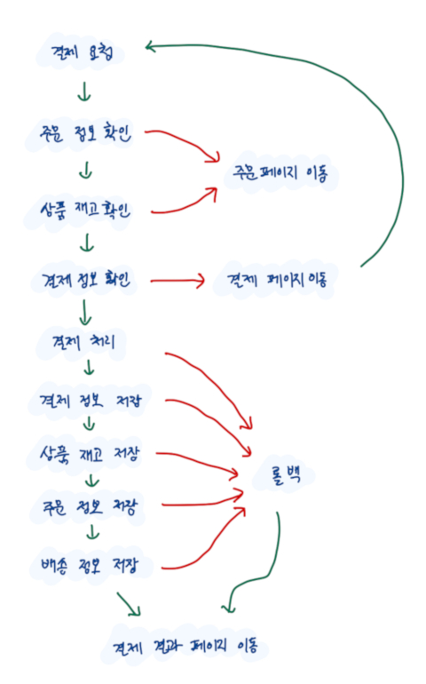

# 비동기 흐름 제어

> 목표: 자바스크립트의 비동기 흐름 제어 방법을 알아보고 이와 관련해서 다양한 패턴 및 예제를 살펴봅니다.

## 비동기 흐름과 콜백

대부분의 자바스크립트 코드에서는 [비동기 작업](https://developer.mozilla.org/ko/docs/Learn/JavaScript/Asynchronous/Concepts)이 발생합니다. 이 때 코드가 동작하는 타이밍을 정확하게 제어하지 못하면 개발자가 의도한대로 프로그램이 동작하지 않으며, 버그로 이어질 수 밖에 없습니다.

자바스크립트에서는 비동기 흐름을 제어하기 위해 전통적으로 [콜백](https://ko.wikipedia.org/wiki/%EC%BD%9C%EB%B0%B1) 방식을 사용했습니다. 아래에서는 비동기 작업을 동기 코드 방식으로 작성했을 때의 모습과, 문제점을 해결하는 콜백 방식의 예시를 살펴보겠습니다.

**동기 코드 방식**: 비동기 코드의 순서를 보장받을 수 없다.

```javascript
function request(url) {
  let response;
  const xhr = new XMLHttpRequest();
  xhr.onreadystatechange = function() {
    if (xhr.readyState == 4 && xhr.status == 200) {
      response = xhr.responseText; // 2. 서버에서 받은 응답을 결과에 저장
    } else {
      response = xhr.status;
    }
  };
  xhr.open('GET', url);
  xhr.send(); // 1. 서버 요청
  return response; // 3. 결과 반환 -> 문제점: 2번의 응답값이 저장 될때까지 기다려 주지 않는다.
}

const res = request('https://jsonplaceholder.typicode.com/todos/1');
console.log(res) // 4. 출력 -> undefined
```

**콜백 방식**: 비동기 코드의 순서를 보장받을 수 있다.

```javascript
function request(url, successCallback, failCallback) {
  const xhr = new XMLHttpRequest();
  xhr.onreadystatechange = function() {
    if (xhr.readyState == 4 && xhr.status == 200) {
      successCallback(xhr.responseText); // 2. 결과값을 콜백의 인자로 전달
    } else {
      failCallback(xhr.status);
    }
  };
  xhr.open('GET', url);
  xhr.send(); // 1. 요청
}

request('https://jsonplaceholder.typicode.com/todos/1', function (res) {
  console.log(res) // 3. 콜백에서 출력 -> {...}
}, function (res) {
  /* on failed */
})
```

콜백 방식으로 비동기 흐름을 제어하는 것은 현재까지도 사용되고 있으나, (아래에서 소개할) 모던 자바스크립트에서 새로 도입된 프로미스 문법과 async/await 문법을 사용하는 것을 권장하고 있습니다.

## 프로미스

[프로미스](https://developer.mozilla.org/ko/docs/Web/JavaScript/Reference/Global_Objects/Promise)는 ES6에서 도입된 자바스크립트 문법으로, 비동기 흐름을 제어할 때 사용됩니다. 프로미스는 현재 결정된 값을 반환하는 것이 아니라, 미래에 결정될 어떤 결과를 **대리자**를 통해 받는 것이라고 생각할 수 있습니다.

### 프로미스 선언부: 상태와 resolve/reject


프로미스 선언부에서 프로미스는 아래의 세 가지 상태값을 가질 수 있습니다.

- 대기(*Pending*) : 비동기 처리 로직이 아직 완료되지 않은 상태
- 완료(*Fulfilled*) : 비동기 처리가 완료되어 프로미스가 결과 값을 반환해준 상태
- 실패(*Rejected*) : 비동기 처리가 실패하거나 오류가 발생한 상태

프로미스 객체를 생성할 땐 `resolve`, `reject` 두 개의 파라미터를 가진 함수를 인자로 받으며, 최초에 *pending* 상태로 존재합니다.

```javascript
new Promise(function (resolve, reject) {
  // state: pending
})
```

*pending* 상태의 프로미스 객체 내에서 `resolve`가 실행되면 *fulfilled* 상태가 됩니다.

```javascript
new Promise(function (resolve, reject) {
  resolve(); // state: pending -> fulfilled
})
```

*pending* 상태의 프로미스 객체에서 `reject`를 실행하면 *rejected* 상태가 됩니다.

```javascript
new Promise(function (resolve, reject) {
  reject(); // state: pending -> rejected
})
```

`resolve`와 `reject`를 함께 사용한 일반적인 프로미스 코드는 아래와 같은 형태가 됩니다.

```javascript
const myPromise = new Promise(function (resolve, reject) {
  // ...
  if (!err) resolve(result); // 성공적으로 결과 전달
  else reject(err); // 뭔가 실패했을 경우
});
```

### 프로미스 실행부: 콜백 or then-catch

선언을 통해 생성된 프로미스 객체의 실행 결과는 콜백 혹은 `then`, `catch` 함수로 전달받을 수 있습니다. 실행되는 이후에 `fulfilled` 혹은 `rejected` 둘 중에 하나의 상태로 결정되며, 어떤 값이든 결정되어 다음 `then`으로 전달된 상태를 `settled`라고 합니다.

특히, `then`과 `catch` 함수의 반환 값은 프로미스 객체이므로 프로미스를 서로 연결할 수 있게 됩니다.

콜백 형태의 프로미스 실행:

```javascript
myPromise(function(result) {
  /* if fulfilled */
  console.log(result)
}, function(err) {
  /* if rejected */
  console.error(err)
})
```

then 형태의 프로미스 실행:

```javascript
myPromise()
  .then(result => {/* ... */}) // if fulfilled
  .catch(err => {/* ... */}) // if rejected
```

#### Quiz

문제: 아래 코드가 어떻게 동작할지 예상해보세요.

```javascript
function addAfterOneSec(a, b) {
  return new Promise(function (resolve) {
    setTimeout(function () {
      resolve(a + b)
    }, 1000)
  })
}

addAfterOneSec(0, 1)
  .then(res => addAfterOneSec(res, 2))
  .then(res => addAfterOneSec(res, 3))
  .then(res => addAfterOneSec(res, 4))
  .then(res => addAfterOneSec(res, 5))
  .then(console.log)
  .catch(console.catch)
```

### 프로미스 체이닝

프로미스 체이닝은 `then`과 `catch`를 통해 프로미스 객체를 연쇄적으로 호출해서 사용하는 것을 말합니다. 일반적인 코드 형태는 아래와 같습니다.

```javascript
function addAfterOneSec(a, b) {
  return new Promise(function (resolve) {
    setTimeout(function () {
      resolve(a + b)
    }, 1000)
  })
}

addAfterOneSec(0, 1)
  .then(res => addAfterOneSec(res, 2))
  .then(res => addAfterOneSec(res, 3))
  .then(res => addAfterOneSec(res, 4))
  .then(res => addAfterOneSec(res, 5))
  .then(console.log)
  .catch(console.catch)
```

### 프로미스 체이닝에서 함수 스타일과 가독성

> 자세한 논의는 [Github 이슈](https://github.com/airbnb/javascript/issues/216#issue-49306579)를 확인하시기 바랍니다.

프로미스에서 체이닝에서 가독성에 대한 문제는 한 번쯤 생각해볼만한 문제입니다. 코딩 스타일에 따라 더욱 읽기 쉽고 명확한 코드가 될 수도 있고, 불필요하게 장황한 코드가 될 수도 있습니다. 아래 두 가지 케이스를 살펴보겠습니다.

case 1: 익명함수 스타일

```javascript
doSomething()
  .then(function(result) {
    // ...
  }).then(function(result2) {
    // ...
  }).then(function(result3) {
    // ...
  }).catch(function(error) {
    // ...
  }).finally(function() {
    // ...
  });
```

case 2: 명명함수 스타일

```javascript
function doTask1(result) {
  // ...
}
function doTask2(result) {
  // ...
}
function handleError(error) {
  // ...
}
function done() {
  // ...
}

doSomething()
  .then(doTask1)
  .then(doTask2)
  .catch(handleError)
  .finally(done);
```

두 가지 방식의 차이는 *명명함수*를 사용하느냐, *익명함수*를 사용하느냐의 차이일 뿐입니다. 하지만, 각 방식에 따라 가독성의 차이가 있을 수 있습니다. **정해진 정답이 있는 것은 아니지만**, 아래의 규칙을 염두에 두고 상황에 맞게 작성하면 되겠습니다. (해당 규칙도 절대적인 것은 아닙니다.)

1. 복잡한 로직이 들어가고 함수 내부가 복잡해질 경우 *명명함수*로 감싼다. (good: 함수 이름은 의미있게 작성)
2. 몇 줄 이내로 끝나는 간단한 코드는 *익명함수*로 처리한다.
3. 명명함수와 익명함수를 되도록 섞어쓰지 않는다. (good: 한 가지 스타일로 일관되게 작성)

### 프로미스의 에러 처리

복잡한 프로미스 체이닝의 경우 적절한 에러 핸들링을 통해 깔끔한 코드 흐름을 만들 수 있습니다. 아래 예시를 보겠습니다.

```javascript
// 상품 결제 요청을 처리하는 프로미스 체이닝
spinnerOn()
  .then(getOrderInfo)     // 1. 주문 정보 확인
  .then(checkOutOfStock)  // 2. 상품 재고 확인
  .catch(redirectToOrderPage) // 에러 처리: 주문 페이지로 이동

  .then(getPaymentInfo)   // 3. 결제 정보 확인
  .catch(redirectToPaymentPage) // 에러 처리: 결제 페이지로 이동

  .then(doPayment)        // 4. 결제 처리
  .then(savePaymentInfo)  // 5. 결제 정보 저장
  .then(saveStockInfo)    // 6. 상품 재고 저장
  .then(saveOrderInfo)    // 7. 주문 정보 저장
  .then(saveShippingInfo) // 8. 배송 정보 저장
  .catch(rollback) // 에러 처리: 트랜잭션 롤백

  .then(redirectToOrderResultPage) // 9. 결제 결과 페이지로 이동
  .finally(spinnerOff)
```

위의 코드는 아래의 흐름도에 대한 프로미스 체이닝 구현이라고 할 수 있습니다.



복잡한 로직을 적절한 에러 핸들링 코드와 프로미스 체이닝을 통해 명확하고 가독성있는 코드를 만들 수 있습니다.

## Async/Await

`async`, `await`는 ES8에서 도입된 자바스크립트 문법입니다. 비동기 코드를 일반적인 동기 코드와 동일한 형태로 작성할 수 있다는 장점이 있으며, try-catch 구문과 함께 사용하면 강력하고 간결한 코드 작성이 가능합니다.

다만, 브라우저 호환성의 이슈가 발생할 수 있으며 old browser를 지원해야 하는 상황이라면 꼭 babel을 통해 트랜스파일을 해줘야 합니다.

### Async 코드에서의 에러 처리

프로미스의 에러 처리에서는 프로미스 체이닝을 통해 구현했었습니다. 하지만, 이는 일반적인 동기코드의 모양과 매우 다르며, 동작하는 스코프 문제로 인해 try-catch 구문을 사용할 수 없습니다. 아래 예제를 살펴보겠습니다.

프로미스 체이닝 방식: try-catch 구문을 통해 에러 제어가 불가능한 문제점

```javascript
try {
  // 프로미스 내에서 발생하는 에러는 프로미스 객체 내의 스코프에서만 제어 가능합니다.
  spinnerOn()
    .then(getOrderInfo)
    .then(checkOutOfStock)
    .then(getPaymentInfo)
    .then(doPayment)
    .then(savePaymentInfo)
    .then(saveStockInfo)
    .then(saveOrderInfo)
    .then(saveShippingInfo)
    .then(redirectToOrderResultPage)
} catch (e) {
  // 아래와 같이 에러 핸들링 불가능
  if (e instanceof OutOfStock) {
    redirectToOrderPage()
  } else if (e instanceof InvalidPaymentInfo) {
    redirectToPaymentPage()
  } else {
    throw e
  }
} finally {
  spinnerOff()
}
```

async 구문에서는 try-catch 문법과 함께 사용하여 완벽히 동기 코드와 동일한 모양의 코드를 작성할 수 있습니다.

async 구문의 에러 처리:

```javascript
try {
  spinnerOn()

  const orderInfo = await getOrderInfo()

  await checkOutOfStock(orderInfo)

  const paymentInfo = await getPaymentInfo()

  try {
    await doPayment(paymentInfo)
    await savePaymentInfo(paymentInfo)
    await saveStockInfo(orderInfo)
    await saveOrderInfo(orderInfo)
    await saveShippingInfo(orderInfo)
  } catch (e) {
    await rollback()
  }

  redirectToOrderResultPage()
} catch (e) {
  // async 함수에서 발생하는 에러는 catch 구문에서 처리 가능
  if (e instanceof OutOfStock) {
    redirectToOrderPage()
  } else if (e instanceof InvalidPaymentInfo) {
    redirectToPaymentPage()
  } else {
    throw e
  }
} finally {
  spinnerOff()
}
```
