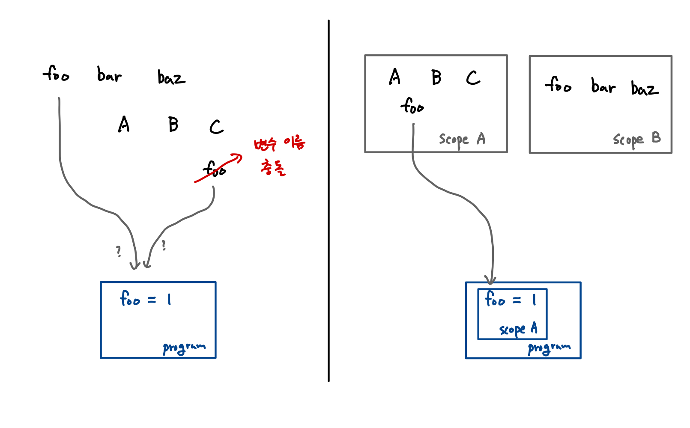

# 스코프와 클로저

프로그래밍 언어에서는 어떤 값을 기억하기 위해 변수라는 개념을 사용합니다. 변수는 저장소 어딘가에 존재하고 있다가 프로그램에 의해 사용됩니다.

변수가 어딘가에 존재한다고 했는데, 하나의 공간에 동일한 이름을 가진 변수가 존재하면 어떤 문제가 발생할까요? 아마 변수를 가져올 때 정확히 어떤 변수를 의도한것인지 프로그램 입장에서 알 수 없을 것입니다. 따라서, **변수 명은 저장소 공간 안에서 유일**하게 존재해야 합니다.

하지만 이런 제약 조건을 가지고 프로그램을 작성하다보면 변수가 많아질수록 변수 명이 고갈되거나 겹쳐서 충돌하는 문제가 발생할 것입니다. 그래서 변수 명이 동일하더라도 이를 **별개의 참조 가능한 영역으로 구분**할 수 있도록 하는 개념이 사용되는데요, 이를 [스코프\(scope\)](https://en.wikipedia.org/wiki/Scope_%28computer_science%29) 혹은 유효범위라고 합니다.



본 문서에서는 스코프의 개념이 자바스크립트에서 어떤 방식으로 동작하는지 알아보겠습니다.

## 전역 스코프와 지역 스코프

자바스크립트에는 전역 스코프와 지역 스코프가 있습니다.

전역 스코프\(Global scope\)는 **프로그램의 모든 곳에서 참조 가능**한 최상위 스코프입니다. 전역 스코프에 존재하는 변수를 전역 변수라고 부르며, 프로그램의 모든 코드에서 사용 가능합니다.

이와 반대로, 특정 범위에서만 참조 가능한 것을 지역 스코프\(Local scope\)라고 합니다. 지역 스코프를 생성하기 위해서는 코드를 **함수 블록**으로 감싸도록 작성해야 하며, 지역 스코프에서 생성된 변수는 **해당 스코프 내에서만 참조 가능**합니다.

```javascript
var foo = "전역 변수입니다.";

function bar() {
  var baz = "bar 함수 스코프의 지역 변수입니다. bar 함수 내부에서만 참조 가능합니다.";
}

console.log(foo); // this is global variable
console.log(baz); // Uncaught ReferenceError: baz is not defined
```


Tip: 전역 변수 사용을 피하자

대부분 전역 변수 사용을 지양하도록 가이드하고 있습니다. 이는 전역 변수를 많이 사용할수록 동작을 예상하기 힘든 프로그램이 되어버리기 때문입니다. 가장 좋은 코드는 변수가 최소한의 접근 범위를 가지도록 스코프를 적절하게 설정하는 것입니다.


## 암묵적 전역

자바스크립트에서는 변수를 선언할 때 명시적으로 `var` 키워드를 붙여주지 않을 경우 전역 변수로 정의해주는데, 이것을 **암묵적 전역\(implicit globals\)**이라고 부릅니다.

암묵적 전역은 함수 블록으로 코드를 감싸더라도 피할 수 없기 때문에 유의해야합니다. 가장 좋은 방법은 암묵적 전역이 일어나지 않도록 변수 선언 시 `var` 키워드를 명시하고, 이를 전역 스코프에 생성함으로써 의도를 명확하게 하는 것입니다.

```javascript
var a = "this is global variable"
b = "this is implicit globals"

function foo() {
  c = "this is also implicit globals"
}

foo();

console.log(a);
console.log(b);
console.log(c);
```


주의: Strict Mode에서는 암묵적 전역이 동작하지 않고 에러를 발생시킵니다.


## 중첩 스코프

함수 블록 내부에 또 다른 함수를 정의할 수 있듯이, **중첩 스코프\(Nested scope\)**는 어떤 스코프가 다른 스코프의 범위 안에 포함되는 것을 말합니다.

중첩 스코프에서 탐색이 일어나는 과정은 **스코프 체이닝**이라고 하는 동작으로 이해할 수 있습니다. 스코프 체인은 쉽게 말해, 가장 가까운 스코프로부터 변수를 찾을 때까지 상위 스코프로 이동 탐색하는 것입니다.

```javascript
var a = 2; // global scope

function foo() {
  var b = 5; // foo scope

  function bar() {
    var c = 3; // bar scope

    console.log(a + b + c);
  }

  bar();
}

foo(); // 10
```

위의 코드에서 `a`, `b`, `c` 변수들은 각각 다른 스코프에 존재하고 있습니다.

1. `a` : 전역 스코프
2. `b` : `foo` 함수 스코프
3. `c` : `bar` 함수 스코프

코드를 살펴보면 `bar` 함수 내에서 모든 변수를 한 번씩 호출하고 있습니다. 이 때, `c` 변수는 `bar` 함수의 스코프에 존재하므로 바로 참조가 가능합니다.

하지만, `b` 변수는 `bar` 함수의 스코프에 존재하지 않으므로, 바로 다음으로 인접한 상위 스코프인 `foo` 함수 스코프를 탐색하게 됩니다. 여기서 `b` 변수를 찾을 수 있기 때문에, 변수를 반환하며 스코프 체이닝이 종료됩니다.

마지막으로 `a` 변수를 `bar` 함수에서 호출했을 때, `bar` 함수에서도 찾을 수 없고 다음 상위 스코프인 `foo` 함수에서도 찾을 수 없으므로 최상위 스코프인 전역 스코프에서 `a` 변수를 탐색합니다. 여기서도 변수를 찾을 수 있으므로 정상적으로 모든 값을 반환하여 다음 코드가 실행될 수 있습니다.

## 함수 스코프와 블록 스코프

자바스크립트는 기본적으로 **함수 스코프\(Function scope\)**의 동작 방식을 따릅니다. 함수 스코프란, 함수를 선언할 시 해당 함수 내부에 별도의 지역 스코프가 생성되는 것을 말합니다.

```javascript
function foo() {
  var a = "this is foo scoped"
}

console.log(a); // Uncaught ReferenceError: a is not defined
```

위에서 볼 수 있듯이 `foo` 함수의 스코프 변수인 `a` 변수를 `foo` 함수 바깥에서 호출할 경우, 해당 변수를 찾을 수 없기 때문에 에러가 발생하는 것을 볼 수 있습니다.

하지만, 함수 스코프는 함수가 아닌 다른 블록\(`for`, `while`, `if`, ...\)에서 별도의 스코프를 가질 수 없다는 문제점이 있습니다. 이러한 문제점을 해결하고자 ES6에서 도입된 키워드가 `let`과 `const`입니다.

```javascript
const countries = ['usa', 'china', 'canada', 'korea'];

for(let i=0; i < countries.length; i++) {
  let country = countries[i];
}

console.log(country); // Uncaught ReferenceError: country is not defined
```

## 렉시컬 스코프

렉시컬 스코프\(Lexical scope\)는 정적 스코프라고 부르기도 하며, 대다수의 프로그래밍 언어에서 채용한 스코프 동작 방식입니다. 렉시컬 스코프에서는 코드를 **선언하는 시점**에 **스코프가 결정**되며, 이는 코드를 호출하는 시점\(런타임\)에 결정되는 방식인 동적 스코프 방식과 차이가 있습니다.


Note: 스코프를 결정한다?

중첩 스코프에서 다룬 예제를 다시 보면, 스코프 중첩이 `foo` &gt; `bar` &gt; `전역` 순서로 일어났다는 것을 자바스크립트 엔진이 이미 알고 있었습니다. 이는 엔진에서 코드를 컴파일하는 과정에서 스코프 간의 중첩 관계를 파악하여 연결하는 과정을 거쳤기 때문에 가능한 일입니다.


### 렉싱 타임

자바스크립트 엔진은 코드를 실행하기 전에 소스코드 문자열을 토큰 단위로 분절하여 의미를 부여하는 처리 과정을 거칩니다. 이는 대다수의 [컴파일러 기반 프로그래밍 언어](https://ko.wikipedia.org/wiki/%EC%BB%B4%ED%8C%8C%EC%9D%BC_%EC%96%B8%EC%96%B4)에서 거치는 과정으로 [렉싱\(lexing\)](https://en.wikipedia.org/wiki/Lexical_analysis)이라고 부릅니다. 렉싱 타임은 이러한 렉서의 처리 과정이 일어나는 시점을 의미합니다.

렉시컬 스코프는 쉽게 말해서 **렉싱 타임에 스코프가 결정되는 것**입니다. 즉, 개발자의 코드가 렉서에 의해서 처리될 때, 코드 내의 변수와 스코프 블록을 확정짓는 것입니다.

## 호이스팅

[호이스팅\(Hoising\)](https://developer.mozilla.org/ko/docs/Glossary/Hoisting)은 사전적 의미로 '끌어올리다' 정도의 뜻을 가진 단어입니다. 자바스크립트에서 호이스팅은 말 그대로 특정 변수를 **스코프의 최상단**으로 끌어올리는듯한 동작을 말합니다.

```javascript
catName(myCatName); // "My cat's name is Chloe"

function catName(name) {
  console.log("My cat's name is " + name);
}

var myCatName = 'chloe';
```

위 코드에서 변수와 함수가 정의되기 전에 호출했음에도 불구하고 정상적으로 동작하는 것을 알 수 있습니다. \(마치 코드가 실행되는 시점에 변수와 함수 선언문을 위로 끌어올린 것 처럼\) 이러한 동작이 어떻게 가능한지를 컴파일 과정과 스코프로 이해할 수 있습니다.


Note: 호이스팅은 `var` 키워드로 선언된 변수에서 일어나지만, `let`이나 `const` 키워드로 선언된 변수에서는 일어나지 않습니다.


### 컴파일링

자바스크립트 코드는 실행되는 과정에서 엔진에 의해 인터프리트 되기 이전에 [JIT\(Just In Time\) 컴파일](https://ko.wikipedia.org/wiki/JIT_%EC%BB%B4%ED%8C%8C%EC%9D%BC) 과정을 거치게 됩니다. \(JIT 컴파일은 매우 빠른 속도로 이뤄지기 때문에 실제로는 마치 일어나지 않는것처럼 보입니다\)

아래 코드를 실행할 때 일어나는 컴파일 과정을 살펴보겠습니다.

```javascript
var a = 2;
```

위의 한 줄 짜리 코드는 컴파일을 거치면서 선언부와 실행부로 나뉘게 됩니다.

여기서 선언부는 `var a`, 실행부는 `a = 2`에 해당합니다. 그 다음 자바스크립트 엔진은 선언부에 해당하는 변수를 스코프의 최상단으로 끌어올리고 실행부는 그대로 둡니다. 결과적으로 JIT 컴파일 이후의 코드는 아래와 같은 모양이 됩니다.

```javascript
var a;
a = 2;
```

보이는것처럼 변수 혹은 함수의 선언부가 스코프의 최상단으로 끌러올려지는 결과를 확인할 수 있습니다.

### 스코프

호이스팅이 일어날 때 변수는 가장 근접한 스코프의 최상단으로 끌어올려질 뿐이지, 전체 프로그램의 첫 줄로 오는게 아닙니다. 아래 코드를 살펴보겠습니다.

```javascript
foo();

function foo() {
  console.log( a ); // undefined
  var a = 2;
}
```

코드에서는 전역 스코프에서 `foo`함수를 정의하고 있으며 `foo` 함수 스코프에서 `a`변수를 정의하고 있습니다.

이제 JIT 컴파일이 일어난 뒤의 코드를 살펴보겠습니다.

```javascript
function foo() {
  var a;
  console.log( a ); // undefined
  a = 2;
}

foo();
```

보이는것처럼 전역 스코프에서는 `foo` 함수가 호이스팅되어 올라가고, `foo` 함수의 지역 스코프에서는 `a` 변수가 호이스팅되어 올라갔습니다.

여기서 알 수 있는 것은 `a` 변수가 `foo` 함수의 지역 스코프 내에서만 움직인다는 사실입니다. 즉, 호이스팅이 일어나더라도 해당 변수나 함수는 가장 근접한 스코프 범위 내에서만 움직인다는 점을 알 수 있습니다.

## 클로저

[클로저\(Closure\)](https://ko.wikipedia.org/wiki/%ED%81%B4%EB%A1%9C%EC%A0%80_%28%EC%BB%B4%ED%93%A8%ED%84%B0_%ED%94%84%EB%A1%9C%EA%B7%B8%EB%9E%98%EB%B0%8D%29)는 함수와 함수가 선언된 렉시컬 환경의 조합입니다. 클로저가 생성되는 코드를 살펴보겠습니다.

```javascript
// 외부 함수
function makeCounter() {
  var count = 0; // 자유 변수

  // 내부 함수
  function increment() {
    return count += 1;
  }

  return increment;
}

// 1. 함수 호출 -> 클로저 생성
var counter = makeCounter();

// 2. 함수 실행
counter(); // 0
counter(); // 1
counter(); // 2
```

클로저를 통해 구현된 카운터 예제입니다. 여기서 세 가지 항목을 주목해야 합니다.

1. 외부 함수 : `makeCounter`
2. 내부 함수 : `increment`
3. 변수 : `count`

`makeCounter`함수를 호출한 결과로 `increment` 함수를 반환하고 함수는 끝나기때문에 안에 있는 변수인 `count`는 사라져버릴것같지만, 그렇지 않고 어딘가에 남아서 `counter`를 호출할 때 마다 1씩 증가되는 것을 볼 수 있습니다.

여기서 변수 `count`가 마치 스냅샷처럼 기억되는 동작이 **캡쳐**입니다.

캡쳐가 일어날 때 렉시컬 스코프에 존재하는 변수, 여기서 `count`는 **자유 변수\(free variable\)**라고 부릅니다. 한 번 클로저가 생성되면 해당 클로저의 자유 변수에 직접 접근할 수 있는 방법은 없으며, 클로저를 통해서만 해당 자유 변수를 조작할 수 있습니다.

### 캡슐화

캡슐화란 특정 객체의 메소드와 속성을 하나로 묶고 객체의 세부 구현 내용을 외부에서 접근하지 못하도록 **은닉**하는 것을 말합니다.

위에서 자유 변수를 조작하는 방법은 클로저를 통해서만 가능하다고 했습니다. 우리는 이제 이런 클로저의 성질을 이용해 [캡슐화\(encapsulation\)](https://ko.wikipedia.org/wiki/%EC%BA%A1%EC%8A%90%ED%99%94)된 코드를 구현할 수 있습니다.

```javascript
function makeBankAccount(name) {
  // 은닉
  var balance = 0;

  function deposit(money) { balance += money }
  function withdraw(money) { balance -= money }
  function getBalance() { return balance }

  // 공개
  return {
    deposit,
    withdraw,
    getBalance,
  }
}

// 1. 클로저 생성
var myAccount = makeBankAccount('chancethecoder');

// 2. 200원 입금하기
myAccount.deposit(200);

// 3. 잔고 확인
myAccount.getBalance(); // 200

// 4. 잔고 변수를 직접 조작 시도
myAccount.balance = 1000000;

// 5. 잔고 확인 (조작 실패) => 잔고 은닉화 성공
myAccount.getBalance(); // 200
```

### 즉시 실행 함수

[즉시 실행 함수\(IIFE\)](https://developer.mozilla.org/ko/docs/Glossary/IIFE)는 자바스크립트에서 클로저를 활용하는 패턴 중 하나입니다. 이름으로 알 수 있듯이, 즉시실행함수는 정의되는 즉시 실행되는 함수입니다. 코드 형태는 아래와 같습니다.

```javascript
// 형식 1: (함수)()
(function () {
  // ...
})()

// 형식 2: (함수())
(function () {
  // ...
}())
```

즉시 실행 함수는 아래와 같은 상황에서 쓸 수 있습니다.

1. 전역 스코프의 오염을 방지하고자 한
2. 반복 호출될 필요가 없다 \(당장 1회만 실행\)

즉시 실행 함수에 인자를 전달하거나, 함수의 실행 결과를 반환하는 것도 가능합니다. 아래 코드를 통해 확인해보겠습니다.

```javascript
// 1. 세제곱 함수 선언
var operator = x => x*x*x;

// 2. IIFE 수행
var result = (function (x, op) { // 인자 받기
  return op(x);
})(3, operator) // IIFE에 인자 넘겨주기

console.log(result) // 27
```

### 모듈 패턴

[모듈 패턴](https://en.wikipedia.org/wiki/Module_pattern)은 코드를 기능 단위로 분리하여 반복적으로 사용될 수 있도록 구성하는 디자인 패턴입니다.

대부분의 프로그래밍 언어에서 이를 구현하기위한 방법을 제공하며, [더글라스 크록포드](https://ko.wikipedia.org/wiki/%EB%8D%94%EA%B8%80%EB%9D%BC%EC%8A%A4_%ED%81%AC%EB%A1%9D%ED%8F%AC%EB%93%9C)에 의해 자바스크립트에서도 이를 구현하기위한 방법이 제시되었습니다.

아래는 기본적인 객체 리터럴을 사용한 모듈 예시입니다.

```javascript
var balance = 0;
var bankAccount = {
  deposit: function (money) {
    balance += money;
  },
  withdraw: function (money) {
    balance -= money;
  },
  getBalance: function () {
    return balance;
  }
}
```

이는 반복되는 코드를 효과적으로 묶어줄 수 있도록 도와주지만, 멤버 변수나 메소드의 프라이버시를 보장할 수가 없다는 문제점이 있습니다. 따라서, 여기에 클로저를 적용하여 은닉 계층을 추가해주고자 합니다.

아래는 프라이버시를 추가하기 위해 즉시 실행 함수를 적용한 모듈 코드입니다.

```javascript
// 즉시 실행 함수
var bankAccount = (function () {
  // 비공개 함수 or 변수 선언
  var balance = 0;

  function deposit(money) { balance += money }
  function withdraw(money) { balance -= money }
  function getBalance() { return balance }

  // 공개 함수 or 변수 반
  return {
    deposit,
    withdraw,
    getBalance,
  }
})()
```

위의 캡슐화에서 확인한 예제 코드와 거의 유사하나, 즉시 실행 함수로 감싸졌다는 차이점이 있습니다.

이는 자바스크립트의 모듈 자체가 싱글톤 패턴과 유사하게 하나의 인스턴스 객체만을 가지도록 의도한것이기 때문에 그렇습니다. 즉, 모듈 패턴에서는 동일한 모듈이 여러 개 생성되지 않아야 합니다.

여기까지는 기본적인 모듈 패턴의 예제이며, 여기에 유용한 테닉을 적용해서 최종적으로 아래와같은 모듈 패턴 코드를 작성할 수 있습니다.

```javascript
// 네임스페이스 패턴
var app = app || {}

// 즉시 실행 함수
app.alertModule = (function () {
  // 의존성 선언
  var alert = window.alert;

  // 비공개 함수 or 변수 선언
  var count = 0;

  function alertCounter() {
    alert(count++);
  }

  // 공개 함수 or 변수 반환
  return {
    alertCounter,
  }
})()

// 호출
app.alertModule.alertCounter()
app.alertModule.alertCounter()
app.alertModule.alertCounter()
```

