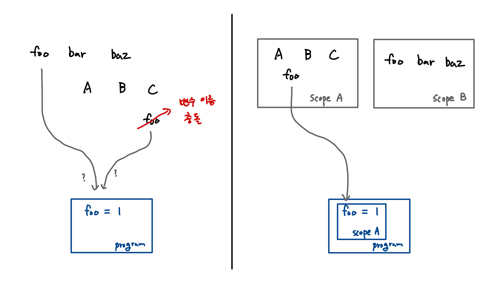

# 스코프와 클로저

프로그래밍 언어에서는 어떤 값을 기억하기 위해 **변수**라는 개념을 사용합니다. 변수는 어딘가에 존재하여 프로그램으로부터 **참조 가능한 주소값**입니다. 프로그램에서는 변수 명을 통해 변수의 실제 주소값을 가져옵니다.

변수가 어딘가에 존재한다고 했는데, 하나의 공간에 동일한 이름을 가진 변수가 존재하면 어떤 문제가 발생할까요? 아마 변수를 참조할 때 정확히 어떤 주소값을 의도하고 참조한것인지 프로그램 입장에서 알 수 없을 것입니다. 따라서, 변수 명은 **공간 안에서 유일하게 존재**해야 합니다.

하지만, 변수가 많아질수록 이름이 동일한 변수 명이 겹쳐서 충돌하는 문제가 발생할 확률이 높아질 것입니다. 그래서 많은 프로그래밍 언어들은 변수 명이 동일하더라도 이를 별개의 참조 가능한 영역으로 구분할 수 있도록 만들었는데요, 여기서 프로그램이 변수를 참조하는 규칙을 [스코프\(scope\)](https://en.wikipedia.org/wiki/Scope_%28computer_science%29) 혹은 유효범위라고 합니다.



다음은 자바스크립트의 스코프 특성과 함께 알아야 할 내용으로 아래에서 설명할 것들입니다.

* 전역 스코프와 지역 스코프
* 중첩 스코프
* 함수 스코프와 블록 스코프 \(ES6+\)
* 렉시컬 스코프
* 호이스팅
* 클로

## 전역 스코프와 지역 스코프

전역 스코프\(Global scope\)는 **프로그램의 모든 곳에서 참조 가능**한 최상위 스코프입니다. 전역 스코프에 존재하는 변수를 전역 변수라고 부르며, 프로그램의 모든 코드에서 사용 가능합니다.

이와 반대로, 특정 범위에서만 참조 가능한 것을 지역 스코프\(Local scope\)라고 합니다. 자바스크립트에서는 함수나 블록으로 감싸지 않은 변수를 전역 변수로 저장합니다.

```javascript
var foo = "전역 변수입니다.";

function bar() {
  var baz = "bar 함수 스코프의 지역 변수입니다. bar 함수 내부에서만 참조 가능합니다.";
}

console.log(foo); // this is global variable
console.log(baz); // Uncaught ReferenceError: baz is not defined
```

> **주의** : 대부분의 경우는 전역 변수 사용을 **지양**하도록 가이드하고 있습니다. 어떤 변수가 필요 이상으로 넓은 범위의 스코프를 가지는 것은 프로그램 내에서 예상하지 못하는 동작으로 인해 변수를 참조하여 변경을 가할 수 있으므로 에러의 원인이 될 수 있기 때문입니다.

### 암묵적 전역

자바스크립트에서 변수 선언 시 명시적으로 `var` 키워드를 붙여주지 않는 경우 전역적으로 접근 가능한 값으로 정의해주는데, 이것을 **암묵적 전역\(implicit globals\)**이라고 부릅니다.

```javascript
var a = "this is global variable"
b = "this is implicit globals"

function foo() {
  c = "this is also implicit globals"
}

foo();

console.log(a);
console.log(b);
console.log(c);
```

> **주의** : Strict Mode에서는 변수 선언 시 키워드가 없을 경우 암묵적 전역이 동작하지 않고 에러를 발생시킵니다.

## 중첩 스코프

함수 블록 내부에 또 다른 함수를 정의할 수 있듯이, 중첩 스코프\(Nested scope\)는 어떤 스코프가 다른 스코프의 범위 안에 포함되는 것을 말합니다.

중첩 스코프에서 탐색이 일어나는 과정은 **스코프 체이닝**이라고 하는 동작으로 이해할 수 있습니다. 스코프 체인은 쉽게 말해, 가장 가까운 스코프로부터 변수를 찾을 때까지 상위 스코프로 이동 탐색하는 것입니다.

```javascript
var a = 2; // global scope

function foo() {
  var b = 5; // foo scope

  function bar() {
    var c = 3; // bar scope

    console.log(a + b + c);
  }

  bar();
}

foo(); // 10
```

위의 코드에서 `a`, `b`, `c` 변수들은 각각 다른 스코프에 존재하고 있습니다.

1. `a` : 전역 스코프
2. `b` : `foo` 함수 스코프
3. `c` : `bar` 함수 스코프

코드를 살펴보면 `bar` 함수 내에서 모든 변수를 한 번씩 호출하고 있습니다. 이 때, `c` 변수는 `bar` 함수의 스코프에 존재하므로 바로 참조가 가능합니다.

하지만, `b` 변수는 `bar` 함수의 스코프에 존재하지 않으므로, 바로 다음으로 인접한 상위 스코프인 `foo` 함수 스코프를 탐색하게 됩니다. 여기서 `b` 변수를 찾을 수 있기 때문에, 변수를 반환하며 스코프 체이닝이 종료됩니다.

마지막으로 `a` 변수를 `bar` 함수에서 호출했을 때, `bar` 함수에서도 찾을 수 없고 다음 상위 스코프인 `foo` 함수에서도 찾을 수 없으므로 최상위 스코프인 **전역 스코프**에서 `a` 변수를 탐색합니다. 여기서도 변수를 찾을 수 있으므로 정상적으로 모든 값을 반환하여 다음 코드가 실행될 수 있습니다.

결론적으로, 자바스크립트에서는 이런 방식의 스코프 중첩이 가능하기 때문에 코드 내에서 현재 사용하는 변수가 정확히 어떤 스코프에서 가져오는 것인지 알아야 합니다. \(= 가장 인접한 스코프의 변수\)

## 함수 스코프와 블록 스코

자바스크립트는 기본적으로 함수 스코프\(Function scope\)의 동작 방식을 따릅니다. 이는 함수를 선언할 시 해당 함수 내부에 별도의 스코프가 생성된다고 이해할 수 있습니다.

```javascript
function foo() {
  var a = "this is foo scoped"
}

console.log(a); // Uncaught ReferenceError: a is not defined
```

위에서 볼 수 있듯이 `foo` 함수의 스코프 변수인 `a` 변수를 `foo` 함수 바깥에서 호출할 경우, 해당 변수를 찾을 수 없기 때문에 에러가 발생하는 것을 볼 수 있습니다.

하지만, 함수 스코프는 함수가 아닌 다른 블록\(`for`, `while`, `if`, ...\)에서 별도의 스코프를 가질 수 없다는 문제점이 있습니다. 이러한 문제점을 해결하고자 ES6에서부터 `let`과 `const`키워드가 도입되었습니다.

```javascript
const countries = ['usa', 'china', 'canada', 'korea'];

for(let i=0; i < countries.length; i++) {
  let country = countries[i];
}

console.log(country); // Uncaught ReferenceError: country is not defined
```

## 렉시컬 스코프

렉시컬 스코프\(Lexical scope\)는 정적 스코프라고 부르기도 하며, 대다수의 프로그래밍 언어에서 채용한 스코프 동작 방식입니다. 렉시컬 스코프에서는 **함수를 선언하는 시점**에 스코프가 결정되며, 이는 함수를 호출하는 시점\(런타임\)에 결정되는 방식인 동적 스코프 방식과 차이가 있습니다.

### 스코프를 결정한다?

중첩 스코프에서 다룬 예제를 다시 보면, 스코프 중첩이 `foo` &gt; `bar` &gt; `전역` 순서로 일어났다는 것을 알 수 있습니다. 그렇다면, 자바스크립트 엔진은 `foo`가 `bar`의 내부에 존재하는 스코프라는 것을 어떻게 알아냈을까요?

이는 **중첩 관계를 분석하여 결정**짓는 과정을 거쳤기 때문입니다. 이러한 과정에서 중첩 관계를 결정짓는 방법 중 하나가 렉시컬 스코프 방식이라고 이해하면 되겠습니다.

### 렉싱 타임

자바스크립트 엔진은 코드를 실행하기 전에 소스코드 문자열을 토큰 단위로 분절하여 의미를 부여하는 처리 과정을 거칩니다. 이는 대다수의 [컴파일러 기반 프로그래밍 언어](https://ko.wikipedia.org/wiki/%EC%BB%B4%ED%8C%8C%EC%9D%BC_%EC%96%B8%EC%96%B4)에서 거치는 과정으로 [렉싱\(lexing\)](https://en.wikipedia.org/wiki/Lexical_analysis)이라고 부릅니다. 렉싱 타임은 이러한 렉서의 처리 과정이 일어나는 시점을 의미합니다.

렉시컬 스코프는 쉽게 말해서 **렉싱 타임에 스코프가 결정되는 것**입니다. 즉, 개발자의 코드가 렉서에 의해서 처리될 때, 코드 내의 변수와 스코프 블록을 확정짓는 것입니다.

## 호이스팅

호이스팅\(Hoising\)은 사전적 의미로 '끌어올리다' 정도의 뜻을 가진 단어입니다. 자바스크립트에서 호이스팅은 말 그대로 특정 변수를 **스코프의 최상단**으로 끌어올리는듯한 동작을 말합니다.

```javascript
catName("Chloe");

function catName(name) {
  console.log("My cat's name is " + name);
}
// "My cat's name is Chloe"
```

위 코드를 보면, 함수의 선언문이 있기 전에 해당 함수를 수행했는데 불구하고 마치 함수 선언문을 위로 끌어올린 것 처럼 정상적으로 동작하는 것을 볼 수 있습니다.

이러한 동작이 어떻게 가능하지를 확인하는 것은 코드가 컴파일 과정과 스코프로 이해할 수 있습니다.

### 컴파일링

자바스크립트 코드는 실행되는 과정에서 엔진에 의해 인터프리트 되기 이전에 [JIT\(Just In Time\) 컴파일](https://ko.wikipedia.org/wiki/JIT_%EC%BB%B4%ED%8C%8C%EC%9D%BC) 과정을 거치게 됩니다. \(실제로는 매우 빠른 속도로 이뤄지기 때문에, 컴파일 과정이 마치 없는 것처럼 보입니다.\)

```javascript
var a = 2;
```

위의 한 줄 짜리 코드는 컴파일을 거치면서 선언부\(`var a`\)와 실행부\(`a = 2`\)로 나뉘게 됩니다.

그 다음 선언부에 해당하는 코드 블럭은 해당 스코프의 맨 위로 끌어올려지는데, 이러한 동작을 호이스팅이라고 부릅니다.

### Per Scope

호이스팅이 일어날 때 변수는 현재 스코프의 최상단으로 끌어올려질 뿐이지, 전체 프로그램의 첫 줄로 오는게 아닙니다.

```javascript
foo();

function foo() {
  console.log( a ); // undefined
  var a = 2;
}
```

위 코드는 개발자가 작성한 코드로 실행되기 이전의 모습이라고 가정합니다. 여기에서 호이스팅이 일어나면 다음과 같은 형태로 실행됩니다.

```javascript
function foo() {
  var a;
  console.log( a ); // undefined
  a = 2;
}

foo();
```

전역 스코프에서는 `foo` 함수가 호이스팅되고, `foo` 함수 내부 스코프에서는 `a` 변수가 호이스팅되고 있습니다.

### let 키워드

let 키워드를 통해 변수를 선언하면, 해당 변수는 호이스팅이 일어나지 않습니다. \(아래의 코드에서는 호이스팅이 일어나지 않고 에러를 발생시킵니다.\)

```javascript
{
  console.log(bar); // Uncaught ReferenceError: Cannot access 'bar' before initialization
  let bar = 2;
}
```

## 클로저

[클로저\(Closure\)](https://ko.wikipedia.org/wiki/%ED%81%B4%EB%A1%9C%EC%A0%80_%28%EC%BB%B4%ED%93%A8%ED%84%B0_%ED%94%84%EB%A1%9C%EA%B7%B8%EB%9E%98%EB%B0%8D%29)는 함수가 속한 렉시컬 스코프를 기억하여, 함수가 해당 스코프 밖에서 실행될 때에도 이 스코프에 접근할 수 있게 하는 기능을 뜻합니다.

```javascript
function sayFeeling(feeling){
    function print(name){
        return name + " is " + feeling;
    }
    return print;
}
    
var sayHappy = sayFeeling("happy");
var saySad = sayFeeling("sad");

sayHappy("Elon Musk"); // Elon Musk is happy
sayHappy("Jeff Bezos"); // Jeff Bezos is happy
saySad("Bill Gates"); // Bill Gates is sad
```

### 즉시 실행 함수\(IIFE\)

### 모듈 패턴

